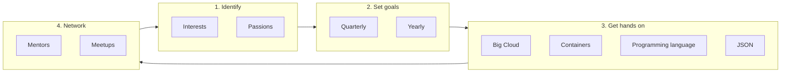

# 5-year career plans
## The process
To create opportunities and self-drive a meaningful career in tech:

## The first step
Brainstorm your current understanding of your Interests, Passions and goals.
Share with Paul and us. 
The more we know about each other, the more we can help each other.

## Your current understanding

### Daniel

### Eche

### Tingru

### Nick

### Nobuhiro

### Warren

### Yichen

# OUTPUT

