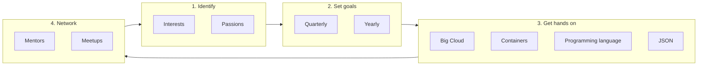

# 5-year career plans
## The process
To create opportunities and self-drive a meaningful career in tech:

## The first step
Brainstorm your current understanding of your Interests, Passions and goals.
Share with Paul and us. 
The more we know about each other, the more we can help each other.

## Your current understanding
I have documented utilities that can help you partially automate the creation of your markdown career table.
One of the utilities is [a few-shot prompt](automation.md#use-genai-to-create-your-table) that was tested against ChatGPT 3.5. 
The other utility is [a Python script](automation.md#use-python-lists-and-pandas) that has dependencies on `pandas` and `tabulate`. 
You are very welcome to use either or neither approach.

### Daniel

### Eche

### Tingru

### Nick

### Nobuhiro

### Warren
| Passions                                | Interests                        | 3 Months                      | 6 Months                              | 1 Year                          | 2 Years                             | 5 Years                  |
|:----------------------------------------|:---------------------------------|:------------------------------|:--------------------------------------|:--------------------------------|:-----------------------------------|:-------------------------|
| Helping people flourish                 | Generative AI                    | AWS Associate Architect     | AWS Associate Developer               | AWS Associate Data Engineer    | AWS Speciality                     | Contribute to core Python|
| Learning things deeply                 | CPython                          | Start a Holberton AWS Cloud Guild | Attended 20 meetups                 | AWS Professional                | AWS Speciality                     | Architect a system that helps people       |
| Understanding systems                  | Design and Architecture Patterns| Published to PIP             | Closed four open-source issues       | Present at a Meetup             | Create a programming language      |                           |
| Psychological safety                   | Cloud Technology                 | Fine-tuned a LM              | Employed as Python/AWS engineer     | Build a GenAI tutor experience | Create a CPython or Pytest Udemy course |                           |
| Teamwork and shared mission            | Empowering People                |                              |                                       | Mentoring others                | Helping to build GenAI systems     |                           |
|                                         | TDD                              |                              |                                       |                                 |                                    |                           |
|                                         | Collaboration tools              |                              |                                       |                                 |                                    |                           |

### Yichen

