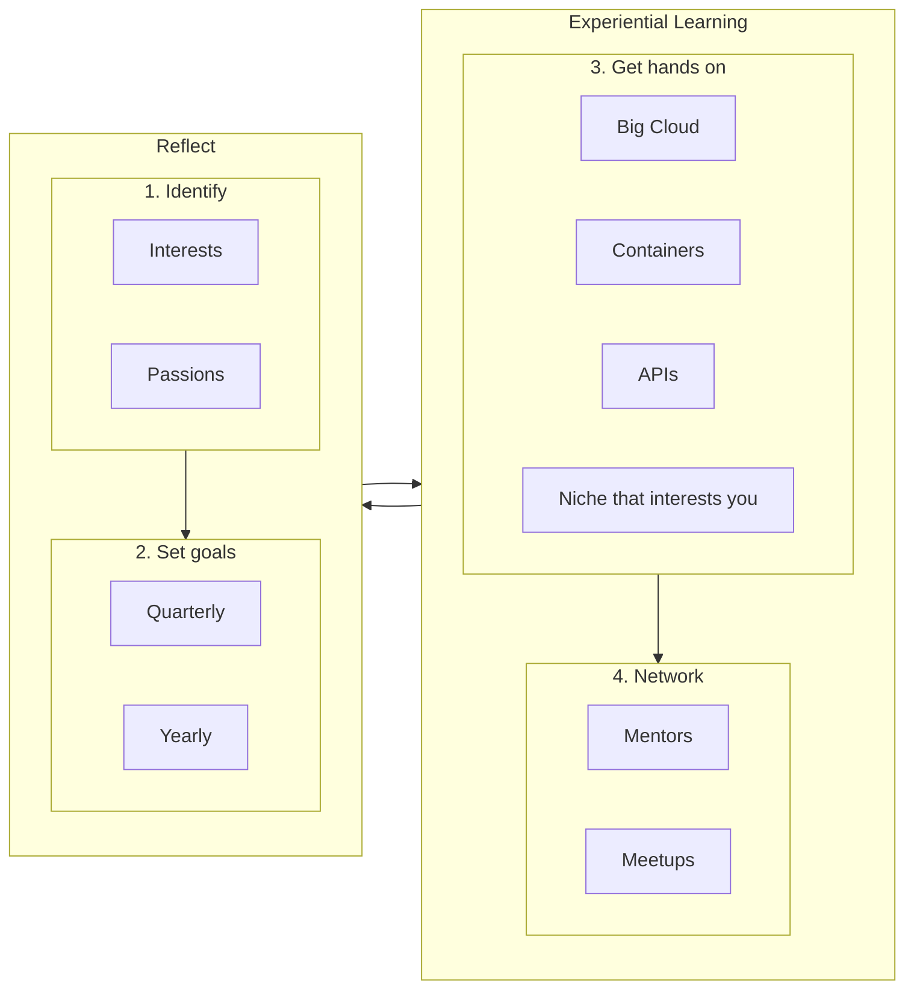

# 5-year career plans
This document:

a) outlines [the process](#the-process) for creating a self-directed career

b) describes [the first step](#the-first-step) to take

c) has a section for each person's [career plan](#current-plan)

## The process
To create opportunities and self-drive a meaningful career in tech, iterate:

## The first step
Brainstorm your current understanding of your Interests, Passions and goals.
Share with Paul and the group. 
The more we know about each other, the more we can help each other.

## Current plan
_Note: If you like how I formatted my information, I have documented two utilities to help you [automate the formatting](automation.md). You are very welcome to use either or neither approach._

### Daniel

### Eche

### Tingru

### Nick

### Nobuhiro

### Paul Silver

### Warren

| Passions                                | Interests                        | 3 Months                      | 6 Months                              | 1 Year                          | 2 Years                             | 5 Years                  |
|:----------------------------------------|:---------------------------------|:------------------------------|:--------------------------------------|:--------------------------------|:-----------------------------------|:-------------------------|
| Helping people flourish                 | Generative AI                    | AWS Associate Architect     | AWS Associate Developer               | AWS Associate Data Engineer    | AWS Speciality                     | Contribute to core Python|
| Learning things deeply                 | CPython                          | Start a Holberton AWS Cloud Guild | Attended 20 meetups                 | AWS Professional                | AWS Speciality                     | Architect a system that helps people       |
| Understanding systems                  | Design and Architecture Patterns| Publish a Python package with full CI/CD            | Closed four open-source issues       | Present at a Meetup             | Create a programming language      |                           |
| Psychological safety                   | Cloud Technology                 | Fine-tuned a LM              | Employed as Python/AWS engineer     | Build a GenAI tutor experience | Create a CPython/Pytest/AWS/Design/GenAI Udemy course |                           |
| Teamwork and shared mission            | TDD               |                              |                                       | Mentoring others                | Helping to build GenAI systems     |                           |
| Empowering People                                         |  Collaboration tools                               |                              |                                       |  Start a Cloud Guild and Python talks where employed                               |                                    |                           |
|                                         |             |                              |                                       |                                 |                                    |                           |

### Yichen

