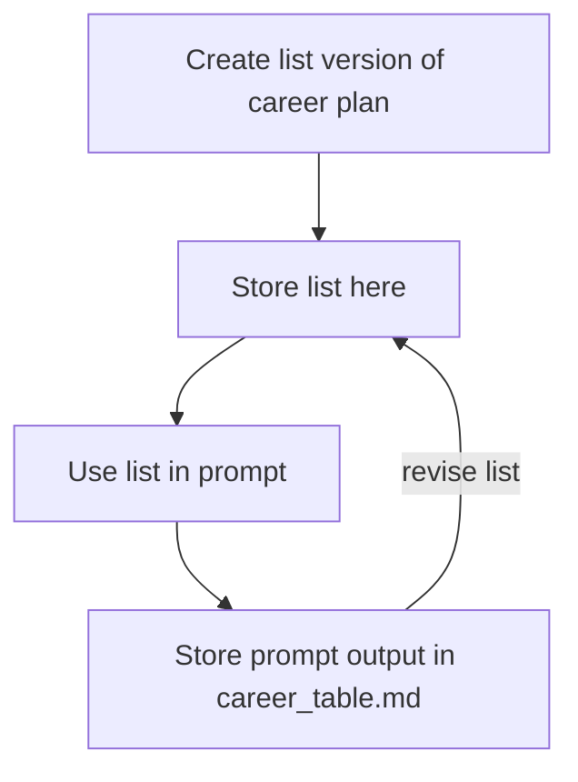

This document stores the inputs to use with the [create your table](https://github.com/WarrenTheRabbit/SelfDirectedCareers/blob/main/automation.md#use-genai-to-create-your-table) program.
In my experience, it is easier to revise the input (which you then feed into the prompt) than it is to revise the markdown table output.

### Daniel

### Eche

### Tingru

### Nick

### Nobuhiro

### Warren

  
Click to expand/collapse

  Passions:
- Helping people flourish
- Learning things deeply
- Understanding systems
- Psychological safety
- Teamwork and shared mission
- Empowering People

Interests:
- Generative AI
- CPython
- Design and Architecture Patterns
- Cloud Technology
- TDD
- Collaboration tools
- Debugging

3 Months:
- AWS Associate Architect
- Start a Holberton AWS Cloud Guild
- Publish a Python package with full CI/CD
- Fine-tuned a LM

6 Months:
- AWS Associate Developer
- Attended 20 meetups
- Closed four open-source issues
- Employed as Python/AWS engineer

1 Year:
- AWS Associate Data Engineer
- Present at a Meetup
- Build a GenAI tutor experience
- Mentoring others

2 Years:
- AWS Speciality
- Create a programming language
- Create a CPython/Pytest/AWS/Design/GenAI Udemy course
- Helping to build GenAI systems

5 Years:
- AWS Speciality
- Contribute to core Python
- Architect a system that helps people
- Start a Cloud Guild and Python talks where employed

### Yichen

